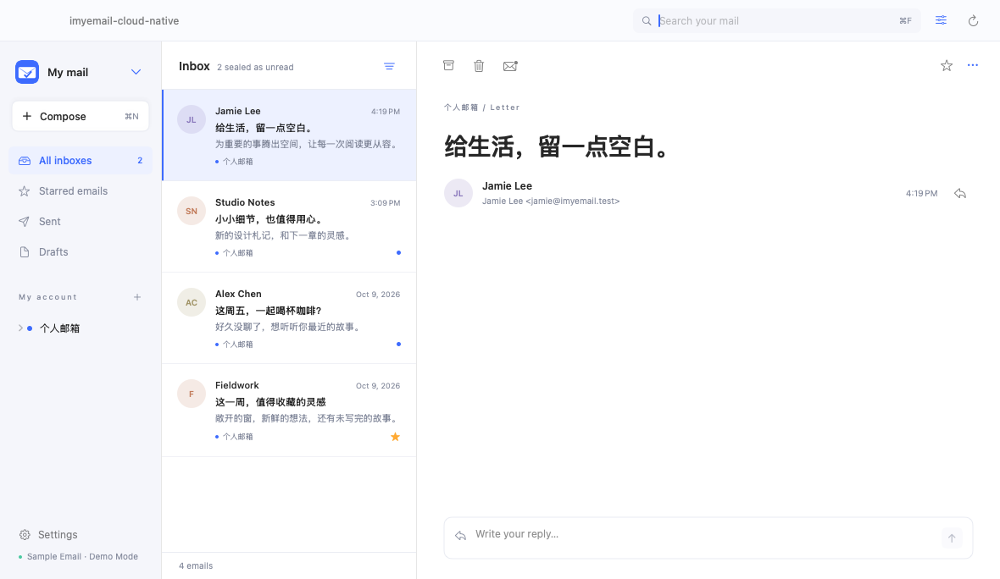
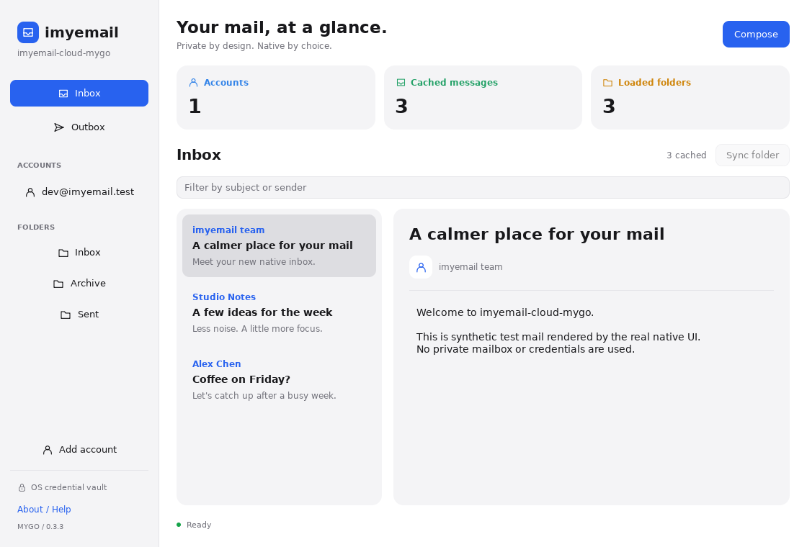

# imyemail-cloud

[English](README.md) · [简体中文](README.zh-CN.md) · [Documentation](docs/README.md) · [Latest downloads](https://github.com/logdns/imyemail-cloud/releases/latest)

## Choose your edition

| **imyemail-cloud-native · 0.2.4** | **imyemail-cloud-mygo · 0.3.4 preview** |
| --- | --- |
| [](https://github.com/logdns/imyemail-cloud/releases/tag/native-v0.2.4) | [](https://github.com/logdns/imyemail-cloud/releases/tag/mygo-v0.3.4) |
| Platform-native UI: macOS, iOS/iPadOS, Android, Linux and Windows. Choose this for the existing client family. | Go-native desktop UI using [egoist/mygo](https://github.com/egoist/mygo), inspired by [Pulse](https://pulse.egoist.dev/): macOS, Windows and Linux; English UI, plain-text mail, fewer features. |
| **[Download Native](https://github.com/logdns/imyemail-cloud/releases/tag/native-v0.2.4)** · `brew install imyemail-cloud-native` | **[Download MyGo](https://github.com/logdns/imyemail-cloud/releases/tag/mygo-v0.3.4)** · `brew install imyemail-cloud-mygo` |

Real UI captures with synthetic mail: macOS Preview and MyGo's headless renderer, not real mailboxes or AI mockups. [Screenshot provenance](docs/screenshots/README.md). Choose your platform below; no source build required. Both editions are free, MIT licensed and independently updated, with separate account data. MyGo is not feature-equivalent to native. Desktop packages are self-signed, **not publicly trusted or Apple-notarized**; iOS IPA requires Apple provisioning.

imyemail-cloud is an MIT-licensed, multi-platform native email client. The public source repository is [github.com/logdns/imyemail-cloud](https://github.com/logdns/imyemail-cloud), and all product links point to [https://imy.email](https://imy.email). Two independent editions are maintained: **imyemail-cloud-native 0.2.4** and **imyemail-cloud-mygo 0.3.4 desktop preview**.

This repository contains only the native clients, shared mail core, optional push bridge, test tooling, build scripts, and open-source documentation. It contains no website/Web application, payments, subscriptions, software activation, device-seat limits, or commercial license gates. Client synchronization and sending do not require a purchased software license.

The [MyGo native desktop preview](desktop-mygo/README.md) uses [egoist/mygo](https://github.com/egoist/mygo), with a separate `mygo-v0.3.4` release track. It preserves the existing clients, data and independent Homebrew installation.

MyGo downloads: [0.3.4 self-signed preview](https://github.com/logdns/imyemail-cloud/releases/tag/mygo-v0.3.4), macOS/Windows/Linux amd64 and arm64. See [installation](docs/INSTALL.md), [signature verification](docs/SIGNING.md) and [version preservation/rollback](docs/VERSIONS.md). Historical [v0.2.1](https://github.com/logdns/imyemail-cloud/releases/tag/v0.2.1), [v0.2.0](https://github.com/logdns/imyemail-cloud/releases/tag/v0.2.0) and [mygo-v0.3.0](https://github.com/logdns/imyemail-cloud/releases/tag/mygo-v0.3.0) remain unchanged.

## Downloads

[Native 0.2.4 self-signed downloads](https://github.com/logdns/imyemail-cloud/releases/tag/native-v0.2.4) · [MyGo 0.3.4 self-signed downloads](https://github.com/logdns/imyemail-cloud/releases/tag/mygo-v0.3.4). GitHub Latest belongs to the native track, not MyGo.

### Homebrew (macOS 14+)

Trust the public tap once, then choose the install command for your edition. Both can also be installed side by side:

```bash
brew tap logdns/imyemail-cloud
brew trust --tap logdns/imyemail-cloud
brew install imyemail-cloud-native
brew install imyemail-cloud-mygo
```

Homebrew 7 requires one-time trust for third-party taps. Update each edition independently with `brew upgrade imyemail-cloud-native` or `brew upgrade imyemail-cloud-mygo`. See the [installation guide](docs/INSTALL.md) for all platforms, verification, uninstall and signing limits. The tap source is public at [logdns/homebrew-imyemail-cloud](https://github.com/logdns/homebrew-imyemail-cloud).

| Platform | Download |
| --- | --- |
| iOS/iPadOS arm64 | [unsigned IPA](https://github.com/logdns/imyemail-cloud/releases/download/native-v0.2.4/imyemail-cloud-native-ios-arm64-20261011-unsigned.ipa), requires Apple provisioning |
| Android | [signed APK](https://github.com/logdns/imyemail-cloud/releases/download/native-v0.2.4/imyemail-cloud-native-android-20261011-selfsigned.apk) |
| macOS Apple Silicon | [self-signed ZIP](https://github.com/logdns/imyemail-cloud/releases/download/native-v0.2.4/imyemail-cloud-native-macos-arm64-20261011-selfsigned.zip) or native Homebrew token |
| Linux x86_64 | [DEB](https://github.com/logdns/imyemail-cloud/releases/download/native-v0.2.4/imyemail-cloud-native-linux-x86_64-20261011.deb) |
| Linux ARM64 | [DEB](https://github.com/logdns/imyemail-cloud/releases/download/native-v0.2.4/imyemail-cloud-native-linux-arm64-20261011.deb) |
| Windows x64 | [self-signed installer](https://github.com/logdns/imyemail-cloud/releases/download/native-v0.2.4/imyemail-cloud-native-windows-x64-20261011-selfsigned-setup.exe) |
| Windows ARM64 | [self-signed installer](https://github.com/logdns/imyemail-cloud/releases/download/native-v0.2.4/imyemail-cloud-native-windows-arm64-20261011-selfsigned-setup.exe) |
| MyGo desktop, six architectures | [separate self-signed packages](https://github.com/logdns/imyemail-cloud/releases/tag/mygo-v0.3.4), independent app and cask |

Verify the matching release's **signed SHA256SUMS** using the pinned certificate in [SIGNING.md](docs/SIGNING.md). macOS/Windows code signatures are self-signed, not publicly trusted/notarized. Linux uses signed manifests, not APT repository signing. iOS remains unsigned. Device/store acceptance is separate.

### MyGo: choose your desktop / CPU

| Platform | MyGo 0.3.4 download |
| --- | --- |
| macOS Apple Silicon | [ZIP](https://github.com/logdns/imyemail-cloud/releases/download/mygo-v0.3.4/imyemail-cloud-mygo-0.3.4-darwin-arm64-selfsigned.zip) |
| macOS Intel | [ZIP](https://github.com/logdns/imyemail-cloud/releases/download/mygo-v0.3.4/imyemail-cloud-mygo-0.3.4-darwin-amd64-selfsigned.zip) |
| Windows x64 | [Portable ZIP](https://github.com/logdns/imyemail-cloud/releases/download/mygo-v0.3.4/imyemail-cloud-mygo-0.3.4-windows-amd64-selfsigned.zip) |
| Windows ARM64 | [Portable ZIP](https://github.com/logdns/imyemail-cloud/releases/download/mygo-v0.3.4/imyemail-cloud-mygo-0.3.4-windows-arm64-selfsigned.zip) |
| Linux x86_64 | [DEB](https://github.com/logdns/imyemail-cloud/releases/download/mygo-v0.3.4/imyemail-cloud-mygo-0.3.4-linux-amd64.deb) / [tar.gz](https://github.com/logdns/imyemail-cloud/releases/download/mygo-v0.3.4/imyemail-cloud-mygo-0.3.4-linux-amd64.tar.gz) |
| Linux ARM64 | [DEB](https://github.com/logdns/imyemail-cloud/releases/download/mygo-v0.3.4/imyemail-cloud-mygo-0.3.4-linux-arm64.deb) / [tar.gz](https://github.com/logdns/imyemail-cloud/releases/download/mygo-v0.3.4/imyemail-cloud-mygo-0.3.4-linux-arm64.tar.gz) |

MyGo has no Android/iOS package. Keep its bundled Rust helper and licenses when extracting. Native is packaged for macOS Apple Silicon only; Intel Mac users can choose MyGo. [Install, verify and upgrade](docs/INSTALL.md).

## Repository layout

| Directory | Contents |
| --- | --- |
| `core/` | Rust IMAP, SMTP, MIME, synchronization, SQLite, HTML sanitization, and native interfaces |
| `desktop-mygo/` | Additional native Go desktop preview, bundled Rust stdio core and six-architecture packaging |
| `apple/` | Native macOS, iOS, and iPadOS SwiftUI clients |
| `android/` | Native Android Jetpack Compose client |
| `linux/` | Native Linux GTK4/libadwaita client |
| `windows/` | Native Windows WinUI 3 client |
| `push-bridge/` | Optional signed webhook push bridge |
| `email-testkit/` | Isolated IMAP/SMTP test fixtures |
| `brand/` | Client brand sources and generation scripts |
| `docs/` | Architecture, development, security, and release documentation |

## Quick start

Shared core:

```bash
cd core
cargo fmt --all -- --check
cargo clippy --workspace --all-targets -- -D warnings
cargo test --workspace --locked
cargo build --locked --release -p chck-cli -p chck-ffi-c
```

Platform prerequisites and commands are documented in the [Apple](apple/README.md), [Android](android/README.md), [Linux](linux/README.md), and [Windows](windows/README.md) guides. See [development](docs/DEVELOPMENT.md), [architecture](docs/ARCHITECTURE.md), and [release](docs/RELEASE.md) documentation for the full workflow.

## Release boundary

Published source passed native regression (10/10) and MyGo six-architecture CI (6/6). [Homebrew installation/signature/coexistence checks](https://github.com/logdns/homebrew-imyemail-cloud/actions/runs/38078815415) pass 3/3, and [independent signed-release sync](https://github.com/logdns/homebrew-imyemail-cloud/actions/runs/38078815748) passes. All fifteen package downloads were independently inspected; see [verification and audit limits](artifacts/20261011-self-signed-tracks/verification.md).

CI builds/tests both editions. Only manually requested main-branch release/preflight jobs on disposable hosted runners receive signing secrets; preflight signs a dummy fixture and never publishes it. Self-signed desktop code and Android APKs do not imply Apple notarization, public trust, real-device acceptance or app-store release; iOS needs valid Apple provisioning. Historical unsigned packages are preserved with their original descriptions.

## Contributing and security

Read [CONTRIBUTING.md](CONTRIBUTING.md) and [CODE_OF_CONDUCT.md](CODE_OF_CONDUCT.md) before contributing. Report security issues privately as described in [SECURITY.md](SECURITY.md); do not disclose unpatched vulnerabilities in a public issue.

## License

[MIT](LICENSE)
